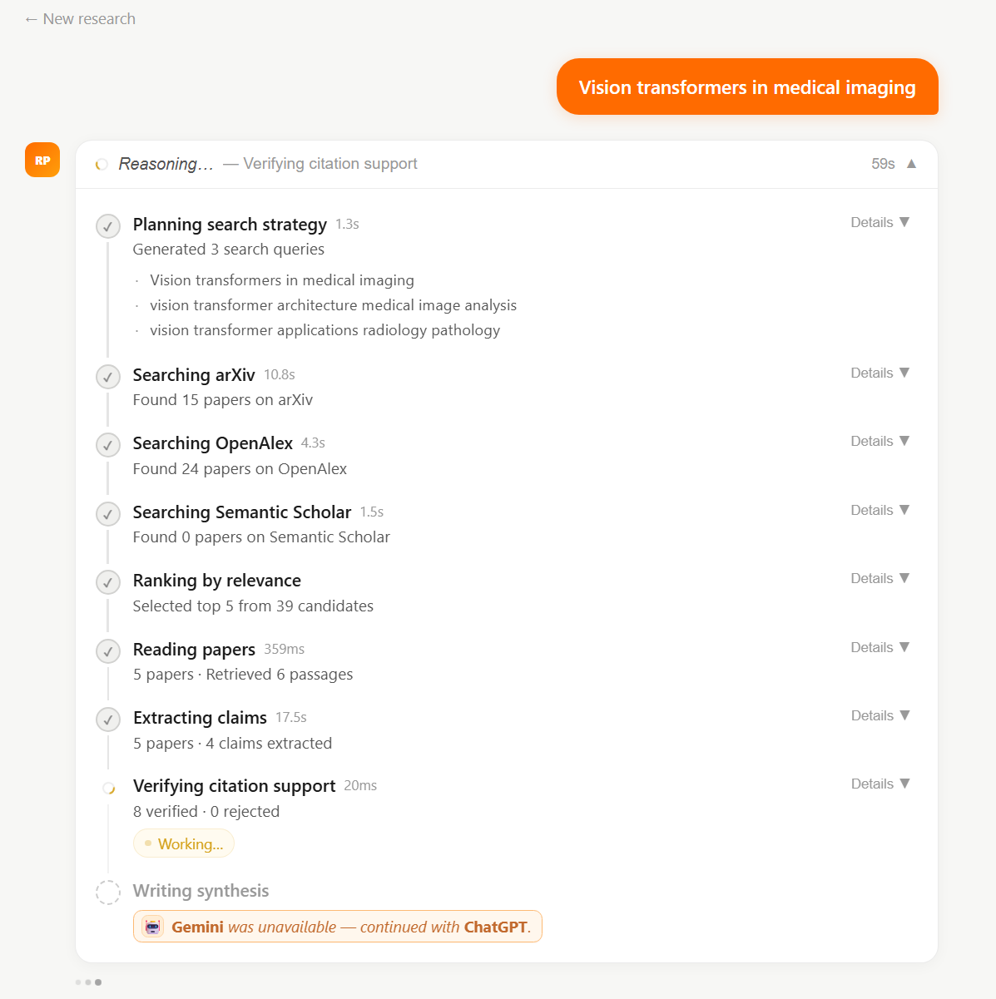
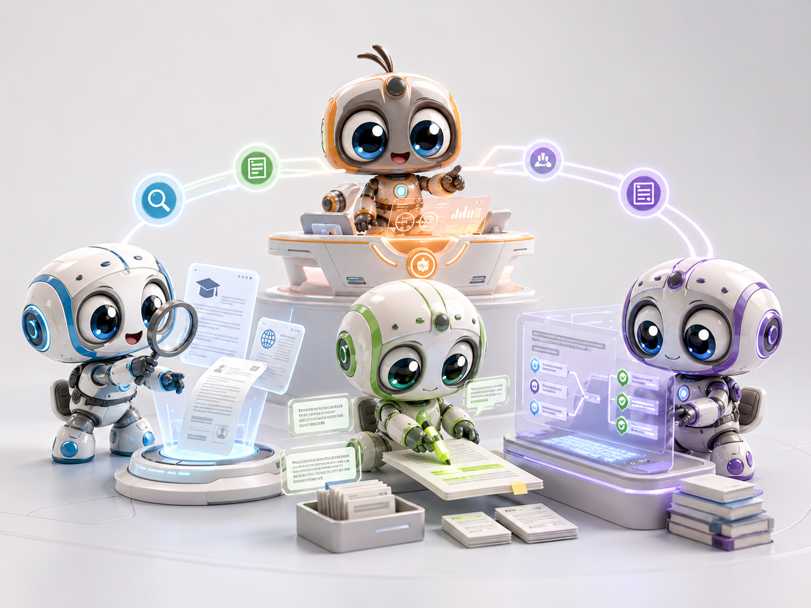
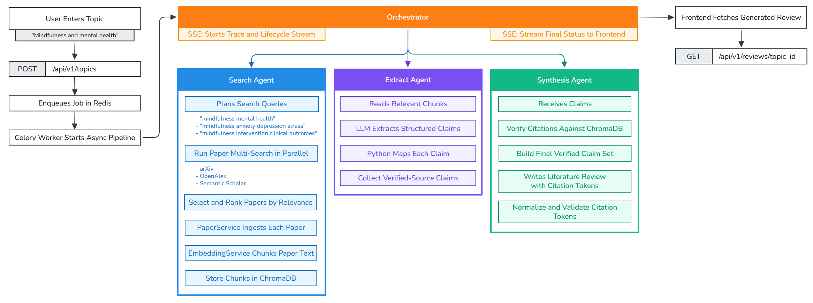
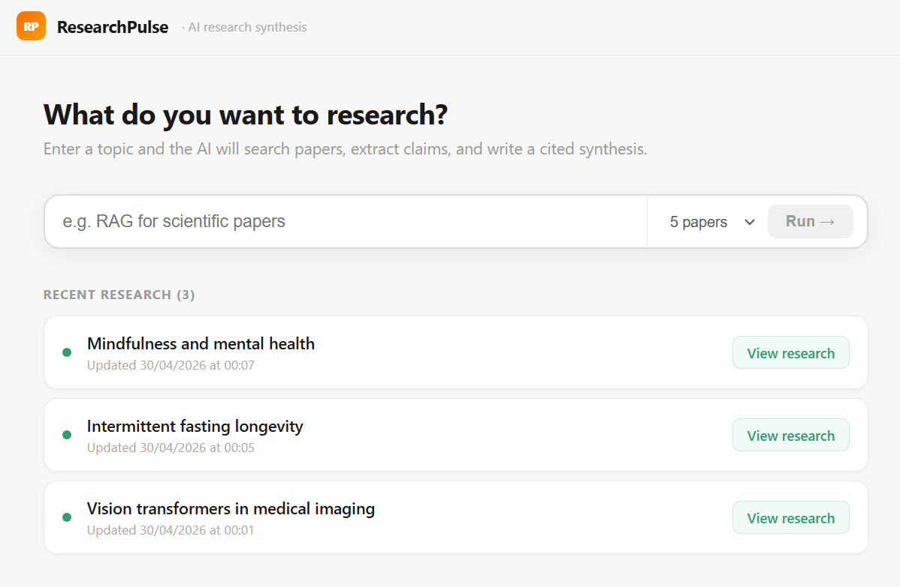
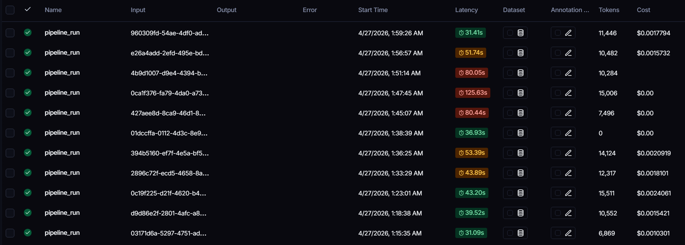
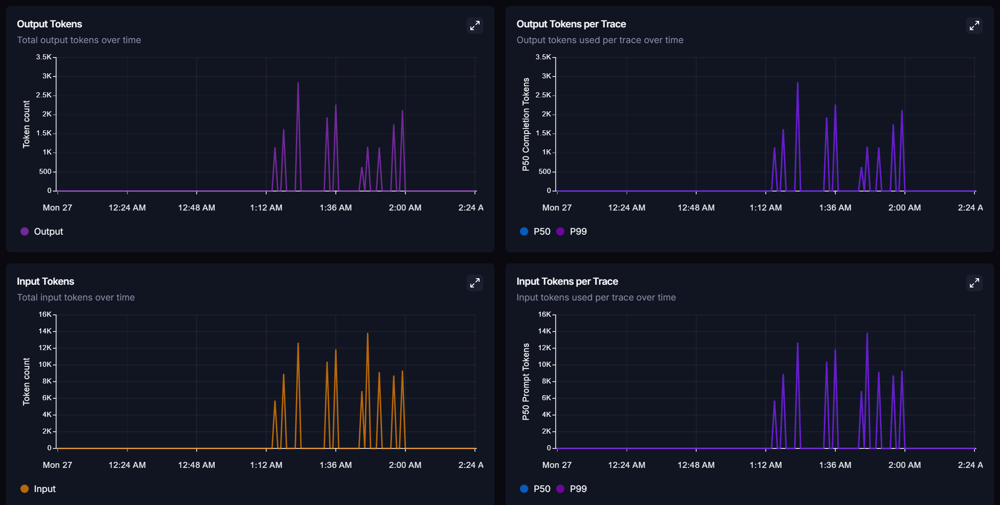
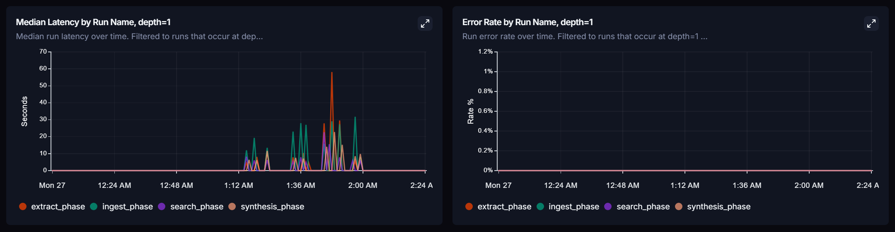

# 📚 ResearchPulse

> **This project is also a study and practice project for agent workflows.** It shows how to build agents without hiding the hard parts: provider calls, retries, tool use, queues, traces, errors, and final output checks.

ResearchPulse is a multi-agent app that searches scientific papers, reads them, checks citations, and writes a clear literature review.


ResearchPulse helps turn a research topic into a grounded literature review. A user enters a term like `Mindfulness and mental health`, and the system searches papers, stores useful text chunks, asks LLM agents to extract claims, validates citations with `chunk_id`, and returns a review with traceable sources.

Demo video: add a GitHub uploaded video link here. GitHub READMEs work best with videos uploaded to GitHub issues, pull requests, releases, or user attachments, then linked in Markdown.

## About This Project

Literature reviews take a lot of time because reading papers is only one part of the job. A good review also needs paper search, claim extraction, citation checks, and a final text that is easy to read.

ResearchPulse was built to make that workflow easier. The product idea is simple: give the app a research topic, wait while the agents reason through the work, and receive a review with citations that can be checked.



## Agent Responsibilities

- `Orchestrator` controls the full run. It decides the order of each step, starts the agents, tracks the job, sends live events to the UI, and stops the workflow when a fatal error happens.

- `Search Agent` finds papers. It plans search queries with an LLM, calls the paper search providers, removes duplicates, ranks the papers, and sends the best papers to the next step.

 - `EmbeddingService` prepares the paper text for search. It splits full text into chunks, stores the chunks in ChromaDB, and keeps metadata like `paper_id` and `chunk_id` so citations can be checked later.

- `Extract Agent` reads stored chunks and extracts useful claims. It uses an LLM to turn paper text into structured claims, but each claim must point back to a real stored chunk.

- `Synthesis Agent` writes the final review. It only uses verified claims, builds citation markers, and rejects citations that do not match a real `chunk_id` in ChromaDB.

## Architecture

ResearchPulse uses a web app, an API, a queue, background workers, a vector database, and LLM calls. The API does not do the full research work during the HTTP request. It creates a job, sends it to Redis, and Celery workers process it in the background. This makes the app better for slow work like paper search, full-text fetches, LLM calls, retries, and error handling.



| Component | What It Does |
|---|---|
| FastAPI | Receives requests, validates input, exposes API routes, and streams live events. |
| Redis | Stores Celery jobs and sends live pub/sub events. |
| Celery | Runs long research jobs outside the request path. |
| ChromaDB | Stores paper chunks for semantic search and citation checks. |
| LangSmith | Tracks LLM calls, timing, costs, and agent traces. |
| Flower | Shows queue status, worker status, retries, and task history. |
| Next.js | Provides the user interface for topics, reasoning, and results. |

## Tech Stack

| Area | Technology |
|---|---|
| Backend | Python 3.11, FastAPI, Celery, SQLAlchemy, Pydantic |
| AI | Gemini through the OpenAI-compatible API, OpenAI SDK, Instructor |
| Vector DB | ChromaDB |
| Queue | Redis, Celery, Celery Beat |
| Observability | LangSmith, Flower, structured logs, persisted traces |
| Frontend | Next.js 14, TypeScript |
| Infrastructure | Docker Compose |

## Getting Started

### 1. Clone the repository

```bash
git clone https://github.com/<your-org>/researchpulse.git
cd researchpulse
```

### 2. Configure environment

```bash
cp .env.example .env
```

Required and useful variables:

| Variable | Description |
|---|---|
| `LLM_PROVIDER` * | LLM provider. Use `gemini` for the main cloud path or `local` for Ollama. |
| `GEMINI_API_KEY` * | Required when `LLM_PROVIDER=gemini`. Get it from Google AI Studio. |
| `LLM_MODEL` | Optional model override. |
| `OPENAI_API_KEY` | Optional fallback provider key. |
| `OPENAI_BASE_URL` | Optional OpenAI-compatible API URL override. |
| `OPENAI_MODEL` | Optional fallback model override. |
| `LANGCHAIN_TRACING_V2` | Set to `true` to send traces to LangSmith. |
| `LANGCHAIN_API_KEY` | LangSmith API key. |
| `LANGCHAIN_PROJECT` | LangSmith project name. Defaults to `researchpulse`. |
| `REDIS_URL` | Redis connection URL. Docker Compose already sets a good default. |
| `CHROMA_HOST` | ChromaDB host. Docker Compose uses `chroma`. |
| `CHROMA_PORT` | ChromaDB port. Docker Compose uses `8000`. |
| `DATABASE_URL` | SQLAlchemy database URL. Docker Compose uses SQLite in `/data`. |

### 3. Start the app

```bash
make dev
```

Local URLs:

| Service | URL |
|---|---|
| Frontend | `http://localhost:3000` |
| API | `http://localhost:8000` |
| API docs | `http://localhost:8000/docs` |
| Flower | `http://localhost:5555` |
| ChromaDB | `http://localhost:8001` |

## How To Use

Open `http://localhost:3000`.



Type a research topic, for example `Mindfulness and mental health`, and start the research run. The app will create a background job and show the reasoning steps while the agents work.


When the job finishes, the result page shows the final review, the selected papers, extracted claims, and citations.


## Key Engineering Decisions

> **ResearchPulse is an agent workflow study, so some technical choices were made to learn and show the full system instead of hiding it behind a high-level framework.**

- **Native Provider SDK Instead Of LangChain Agents** - The agents call providers through the OpenAI-compatible SDK path instead of using a LangChain agent runtime. This gives direct control over tool loops, retries, fallbacks, circuit breakers, malformed responses, logs, and fatal errors.

- **Multi-LLM Calls** - The LLM layer supports more than one provider path. This helps test provider fallback, retry rules, response validation, rate limits, and different failure types such as timeouts, bad JSON, empty responses, and fatal provider errors.

- **Citation Grounding Via `chunk_id` Validation** - LLMs can write citations that look real but are not linked to real source text. ResearchPulse checks each citation in code. A citation must point to a stored `chunk_id` and the expected `paper_id` before it can be used in the final review.

- **Queues For Long Jobs** - Research workflows can take minutes. They call external APIs, fetch papers, write vector chunks, ask LLMs for structured output, and may need retries. Redis and Celery keep this work outside the HTTP request and make it easier to retry, inspect, and run with multiple workers.

- **Two SSE Streams** - The app uses two live streams. One stream sends simple job status like queued, started, done, and failed. The other stream sends detailed trace events like agent steps, tool calls, token counts, timings, and errors. This keeps the main UI fast while still allowing deep debugging.

- **Error Handling And Dead Letter Queue** - Some failures are retried with exponential backoff. Some failures are fatal and stop the job with a clear error. If a task keeps failing, it can be moved to the Dead Letter Queue so it can be inspected later instead of being lost.

## Project Structure

```text
researchpulse/
├── backend/
│   ├── app/
│   │   ├── agents/          Agent order, decisions, and workflow control.
│   │   ├── tools/           Search, fetch, and vector tools used by agents.
│   │   ├── services/        Business logic with no HTTP route code.
│   │   ├── jobs/            Celery task definitions.
│   │   ├── repositories/    Database access.
│   │   ├── models/          Pydantic schemas and data contracts.
│   │   ├── api/             FastAPI routes.
│   │   ├── observability/   Logs, traces, and LLM tracking helpers.
│   │   ├── resilience/      Retry and circuit breaker code.
│   │   └── pipelines/       High-level pipeline entry points.
│   ├── tests/               Unit and integration tests.
│   ├── main.py              FastAPI app entrypoint.
│   └── celery_worker.py     Celery app and scheduled jobs.
├── frontend/
│   └── src/app/             Next.js screens for topics, traces, and reviews.
├── docs/
│   └── images/              Project images, screenshots, and robot agents.
├── docker-compose.yml       Local stack.
├── Makefile                 Local commands.
└── README.md
```

## Endpoints

The easiest way to inspect the API is through the local Swagger docs:

```text
http://localhost:8000/docs
```

## Observability

ResearchPulse can send traces to LangSmith. This helps track LLM calls, cost, latency, prompts, responses, retries, and agent steps. The app also stores local traces so the frontend can show what happened during a run.

Flower is available at `http://localhost:5555` to inspect Celery workers, queue state, retries, and failed tasks.

| | | |
|-|-|-|
|  |  |  |

## Tests

The project has three main test types.

- **Unit tests** check small parts of the system, like agent ranking logic or provider execution rules. They are fast and do not need an API key.

- **End-to-end tests** run the main research pipeline with real components and check that papers, claims, citations, and reviews are produced as expected.

- **LLM evaluation tests** run a small quality check with RAGAS or a local fallback. They compare generated answers with expected answers and retrieved context to catch weak or ungrounded output.
